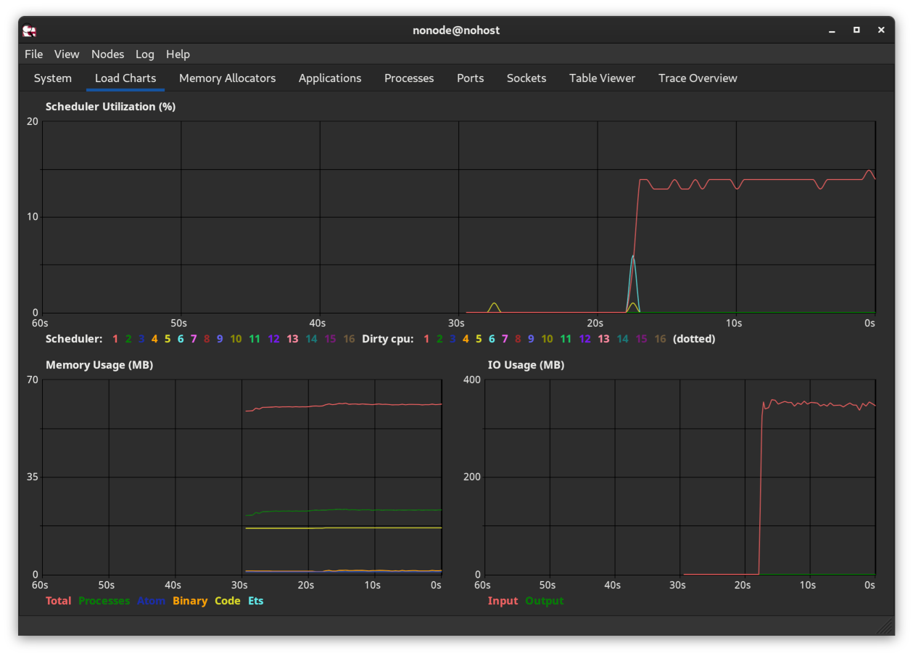

# ExCmd

[](https://github.com/akash-akya/ex_cmd/actions/workflows/elixir.yml)
[](https://hex.pm/packages/ex_cmd)
[](https://hexdocs.pm/ex_cmd/)

ExCmd is an Elixir library for running and communicating with external programs using a back-pressure mechanism. It provides a robust alternative to Elixir's built-in [Port](https://hexdocs.pm/elixir/Port.html) with improved memory management through demand-driven I/O.

## The Port I/O Problem

When using Elixir's built-in [Port](https://hexdocs.pm/elixir/Port.html), running external programs that generate large amounts of output (like streaming video using `ffmpeg`) can quickly lead to memory issues. This happens because Port I/O is not demand-driven - it consumes output from stdout as soon as it's available and sends it to the process mailbox. Since BEAM process mailboxes are unbounded, the output accumulates there waiting to be received.

### Memory Usage Comparison

Let's look at how ExCmd handles memory compared to Port when processing large streams:

Using Port (memory grows unbounded):
```elixir
Port.open({:spawn_executable, "/bin/cat"}, [{:args, ["/dev/random"]}, {:line, 10}, :binary, :use_stdio])
```


Using ExCmd (memory remains stable):
```elixir
ExCmd.stream!(~w(cat /dev/random))
|> Enum.each(fn data ->
  IO.puts(IO.iodata_length(data))
end)
```



ExCmd solves this by implementing:
- Demand-driven I/O with proper back-pressure
- Efficient use of OS-backed stdio buffers
- Stream-based API that integrates with Elixir's ecosystem

## Key Features

- **Back-pressure Support**: Controls data flow between your application and external programs
- **Stream Abstraction**: Seamless integration with Elixir's Stream API
- **Memory Efficient**: Demand-driven I/O prevents memory issues with large data transfers
- **Cross-platform**: Pre-built binaries for MacOS, Windows, and Linux
- **Process Management**: Proper program termination with no zombie processes
- **Selective I/O Control**: Ability to close stdin while keeping stdout open
- **No Dependencies**: No separate middleware or shim installation required

## Installation

Add `ex_cmd` to your list of dependencies in `mix.exs`:

```elixir
def deps do
  [
    {:ex_cmd, "~> x.x.x"}
  ]
end
```

## Quick Start Examples

### Basic Command Execution

```elixir
# Simple command execution
ExCmd.stream!(~w(echo Hello))
|> Enum.into("")
# => "Hello\n"

# Get your IP address
ExCmd.stream!(~w(curl ifconfig.co))
|> Enum.into("")
```

### Working with Input Streams

```elixir
# String input
ExCmd.stream!(~w(cat), input: "Hello World")
|> Enum.into("")
# => "Hello World"

# List of strings
ExCmd.stream!(~w(cat), input: ["Hello", " ", "World"])
|> Enum.into("")
# => "Hello World"

# Binary data
ExCmd.stream!(~w(base64), input: <<1, 2, 3, 4, 5>>)
|> Enum.into("")
# => "AQIDBAU=\n"

# IOData
ExCmd.stream!(~w(base64), input: [<<1, 2>>, [3], [<<4, 5>>]])
|> Enum.into("")
# => "AQIDBAU=\n"
```

### Media Processing Examples

```elixir
# Extract audio from video with controlled memory usage
ExCmd.stream!(~w(ffmpeg -i pipe:0 -f mp3 pipe:1),
  input: File.stream!("music_video.mkv", [], 65536))
|> Stream.into(File.stream!("music.mp3"))
|> Stream.run()

# Process video streams efficiently
ExCmd.stream!(~w(ffmpeg -i pipe:0 -c:v libx264 -f mp4 pipe:1),
  input: File.stream!("input.mp4", [], 65536),
  max_chunk_size: 65536)
|> Stream.into(File.stream!("output.mp4"))
|> Stream.run()
```

### Error Handling

```elixir
# stream!/2 raises on non-zero exit status
ExCmd.stream!(["sh", "-c", "exit 10"])
|> Enum.to_list()
# => ** (ExCmd.Stream.AbnormalExit) program exited with exit status: 10

# stream/2 returns exit status as last element
ExCmd.stream(["sh", "-c", "echo 'foo' && exit 10"])
|> Enum.to_list()
# => ["foo\n", {:exit, {:status, 10}}]
```

### Advanced Features

```elixir
# Redirect stderr to stdout
ExCmd.stream!(["sh", "-c", "echo foo; echo bar >&2"],
  stderr: :redirect_to_stdout)
|> Enum.into("")
# => "foo\nbar\n"
```

## Alternatives

- For NIF-based solutions without middleware overhead, consider [Exile](https://github.com/akash-akya/exile)
- For simple command execution without streaming, Elixir's built-in Port might be sufficient

## Documentation

Detailed documentation is available at [HexDocs](https://hexdocs.pm/ex_cmd/).

## License

See [LICENSE](LICENSE) file for details.
